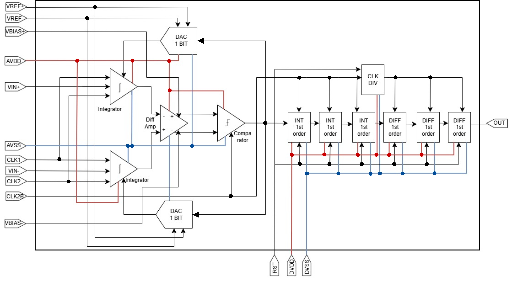

# Low-Power 12-Bit First-Order Delta-Sigma (ΣΔ) ADC — GF180MCU

  
  
  
  

  
  
  
  
  
  

**Team A52 — ARNSChips** · Bandung Institute of Technology
[@rafiihsanalfathin123](https://github.com/rafiihsanalfathin123) (lead) · [@MuhammadNabilRaihan16523191](https://github.com/MuhammadNabilRaihan16523191) · [@angelinaaw](https://github.com/angelinaaw) · [@Putradika-118](https://github.com/Putradika-118) · [@bukananda](https://github.com/bukananda)

**Track: A — Foundational Building Blocks** (reusable analog/mixed-signal IP with emphasis on robust verification and reusability)

---

## Functionality and Target Specification

This project implements a **low-power, reusable 12-bit analog-to-digital converter macro** on the open-source GF180MCU process, built as a **first-order, single-bit, discrete-time (switched-capacitor) Delta-Sigma modulator** followed by an on-chip **3rd-order CIC decimation filter**. The modulator — a fully differential switched-capacitor integrator (folded-cascode-class fully differential OTA), a latched comparator acting as the 1-bit quantizer, and a 1-bit transmission-gate feedback DAC — oversamples the differential analog input at fs = 12.288 MHz and converts it into a noise-shaped 1-bit pulse-density bitstream. The CIC filter (synthesized through the OpenROAD/LibreLane RTL-to-GDS flow) then low-pass filters and downsamples this bitstream by OSR = 256, delivering a **12-bit PCM output at 48 kS/s** over a 24 kHz signal bandwidth.

The single-bit architecture is chosen because its two-level feedback DAC is **inherently linear**, tolerating the device mismatch of an open-source PDK without trimming or calibration, while oversampling and noise shaping push quantization noise out of band. Target applications are low-power sensing / data-acquisition front-ends and the ADC block of a biomedical wireless receiver chain [2].

| Parameter | Target | Justification (why this number) | Verified by |
|---|---|---|---|
| Supply | 3.3 V | GF180MCU 3v3 device option, single rail | all testbenches |
| Architecture | 1st-order 1-bit DT ΣΔ + CIC³ | inherently linear 1-bit DAC; matching-tolerant | loop TB + RTL sim |
| Sampling clock fs | 12.288 MHz | matches implemented CIC & SDC (81.38 ns) | transient TB + STA |
| OSR | 256 | SQNR ceiling 74.9 dB → supports 12-bit word | `clock_div` ÷256 (in RTL) |
| Signal bandwidth | 24 kHz | fs / (2·OSR) | FFT band 0–24 kHz |
| Output | 12-bit PCM @ 48 kS/s | CIC `out[11:0]`, truncation [24:13] of 25-bit bus | **bit-true RTL sim ✓** |
| SNDR (in-band) | > 65 dB | ≈10 dB implementation margin under ceiling | 2¹⁵-pt bitstream FFT |
| ENOB | > 10 bit | (SNDR − 1.76) / 6.02 | same FFT |
| Input | fully diff., VCM 1.65 V | max swing on 3.3 V rail; CM rejection | .op + transient |
| References | VREF± = 3.3 / 0 V | rail-to-rail TG DAC, no headroom loss | **DAC TB ✓ PASS** |
| Power (total) | < 3 mW | OTA 1.572 mW measured + budget for rest | per-block power sims |
| Area / pins | ~500×500 µm · ~15 pins | padring allocation ([issue #156](https://github.com/sscs-ose/sscs-chipathon-2026/issues/156)) | layout phase |
| Robustness | TT/SS/FF · −40…125 °C · VDD±10 % | industrial range plan | corners pending |

> Peak SQNR of an ideal 1st-order 1-bit modulator: `SQNR = 6.02·N + 1.76 − 5.17 + 30·log10(OSR)` [4] → 74.9 dB (ENOB ≈ 12.1 b) at OSR = 256, giving ~10 dB of implementation margin over the >65 dB target.

## Block Diagram & Pinouts

  

<h4 align="center" style="font-size:16px;">Figure 1. System block diagram of the first-order ΣΔ ADC (modulator + 3rd-order CIC decimation filter)</h4>

### Block functionality & complexity

| Block | Function | Complexity | Notes |
|---|---|:---:|---|
| Fully Differential Amplifier (OTA) | Main gain element inside the SC integrator; sets integrator accuracy, settling, and noise | ★★★★☆ | gm/ID-sized; gain/UGF/PM trade-off via L-sweep; real CMFB still to be integrated (ideal helper in current TBs) |
| Switched-Capacitor Integrator | Loop filter: accumulates (input − DAC feedback) each cycle and shapes quantization noise +20 dB/dec | ★★★★☆ | Non-overlapping Φ1/Φ2; Cs/Cf = 1; kT/C non-binding at OSR 256 — cap sizing driven by matching/charge injection |
| Latched Comparator | 1-bit quantizer: clocked polarity decision on the integrator output → PDM bitstream | ★★★☆☆ | Wp/Wn = 2:1, L = 1 µm > Lmin for low offset; metastable "floating zone" identified and narrowed; decision time re-target at fs |
| 1-bit Feedback DAC | Converts the bitstream back to VREF+/VREF− into the integrator summing path | ★★☆☆☆ | **Verified ✓** (Rds 800 Ω, leakage 5.22 pA, delay 6.07 ns, 0.455 µW); TG chosen over inverter for rail-to-rail levels + isolation |
| CIC Decimation Filter (digital) | 3rd-order CIC: removes out-of-band shaped noise and decimates ÷256 → 12-bit PCM @ 48 kS/s | ★★★☆☆ | Multiplier-free; 25-bit internal bus (overflow-free by construction), truncation [24:13]; iverilog-verified; LibreLane config + SDC ready |
| Clock Phases (CLK1/CLK2/CLK2B) | Non-overlapping sampling/integration phases + complement for transmission gates | ★☆☆☆☆ | Generated off-chip for this tapeout; on-chip non-overlap generator is a stretch goal |

*Complexity scale: ★☆☆☆☆ (simple, verified pattern) → ★★★★★ (many coupled design constraints).*

### Pinout

| # | Name | Type | Direction | Description |
|--:|---|---|---|---|
| 1 | AVDD | 3.3 V Power | Bidirectional | Analog supply — OTA, SC integrator, comparator core, DAC |
| 2 | AVSS | Ground | Bidirectional | Analog ground |
| 3 | DVDD | 3.3 V Power | Bidirectional | Digital supply — CIC decimation filter, clock/output buffers |
| 4 | DVSS | Ground | Bidirectional | Digital ground |
| 5 | VBIAS+ | Analog | Input | OTA bias voltage, PMOS branch (Vbiasp, ≈2.30 V nominal) |
| 6 | VBIAS− | Analog | Input | OTA bias voltage, NMOS branch (Vbiasn, ≈0.89 V nominal) |
| 7 | IN+ | Analog | Input | Differential analog input, positive (centered at 1.65 V CM) |
| 8 | IN− | Analog | Input | Differential analog input, negative |
| 9 | OUT | Digital | Output | 1-bit ΣΔ PDM bitstream (12-bit PCM available from on-chip CIC) |
| 10 | CLK1 | Analog | Input | Sampling-phase clock Φ1 (non-overlapping with Φ2), 12.288 MHz domain |
| 11 | CLK2 | Analog | Input | Integration-phase clock Φ2 (non-overlapping with Φ1) |
| 12 | CLK2B | Analog | Input | Complement of Φ2 for transmission-gate switches |
| 13 | RST | Digital | Input | Reset for the digital decimation filter (active-low inside RTL) |
| 14 | VREF+ | Analog | Input | DAC reference high, 3.3 V nominal (decoupled off-chip) |
| 15 | VREF− | Analog | Input | DAC reference low, 0 V nominal |

*Pin types/directions follow the team [pin-requirement sheet](https://docs.google.com/spreadsheets/d/1fF8oxbtLJM7w2VgKkdR7hZ5m95WEj2S6m3JAmWGvgTE/edit?gid=0#gid=0); clock pins are typed "Analog" because they directly drive the analog switch network. Power/clock domains: single 3.3 V level (no level shifters), AVDD/DVDD separated at the padring for isolation; fs = 12.288 MHz and the on-chip synchronous ÷256 domain (48 kHz) are declared in the SDC.*

## Component Specification

Each block lives in its own folder with the schematic (`.sch`), symbol (`.sym`), testbench, and a **progress-log README** containing target specs, design decisions, simulation methodology, and results. (Detailed Specification, tabulated in Folder*)

| Block | Folder (schematic + README) | Testbench | Headline result |
|---|---|---|---|
| Fully Differential Amplifier | [`src/schematics/FULLY DIFFERENTIAL AMPLIFIER`](src/schematics/FULLY%20DIFFERENTIAL%20AMPLIFIER) | `fullydiffamp_tb.sch` | VOCM = 1.650 V, power 1.572 mW (measured .op) |
| SC Integrator (1st order) | [`src/schematics/INTEGRATOR FIRST ORDER`](src/schematics/INTEGRATOR%20FIRST%20ORDER) | see README | Staircase integration + non-overlap clocks verified |
| Latched Comparator | [`src/schematics/latched comparator`](src/schematics/latched%20comparator) | `COMP_TB.sch` | Clean HIGH/LOW decisions; floating zone characterized |
| 1-bit DAC | [`src/schematics/DAC 1 BIT`](src/schematics/DAC%201%20BIT) | `DAC_1_BIT_TB.sch` | **All targets PASS** (see below) |
| CIC Decimation Filter | [`src/filter_decimation`](src/filter_decimation) | `tb_cic_filter.v` + unit TBs | 12-bit output verified bit-true in iverilog |

**Fully Differential Amplifier** — the only gain element in the loop; amplifies the differential error signal while rejecting common-mode noise, and must settle the integrator output within each clock phase. Targets: DC gain > 60 dB, UGF > 100 MHz, PM > 55°, CL = 0.5 pF/side, within the < 3 mW ADC budget (measured 1.572 mW). Sized with the gm/ID methodology on GF180MCU lookup tables; a real CMFB replaces the ideal helper before layout.

**Switched-Capacitor Integrator** — accumulates `Vout[n] = Vout[n−1] + (Cs/Cf)·(Vin[n] − Vdac[n])` with Cs/Cf = 1 on non-overlapping Φ1/Φ2. Switch Ron < 1 kΩ, charge-transfer accuracy > 99.9 %; settling within the integration phase at fs is the binding OTA requirement.

**Latched Comparator** — clocked 1-bit quantizer. Input offset < 15 mV is tolerable (static offset only shifts ADC DC offset in a 1st-order loop); the real design drivers are metastability and kickback (< 5 mV), addressed by Wp/Wn = 2:1 balance and L = 1 µm sizing.

**1-bit DAC (transmission gate)** — selects VREF+/VREF− per bitstream bit; two-level operation makes it inherently linear. Block-level verification complete: Rds 800 Ω (< 1 kΩ), off-leakage 5.22 pA (< 10 pA), I/O delay 6.07 ns (< 100 ns), average power 0.455 µW — all PASS.

**CIC Decimation Filter** — 3rd-order Hogenauer CIC [5]: three integrators at fs, ÷256 clock divider, three differentiators at fs/256; 25-bit internal width (1 + 3·log₂256) guarantees overflow-free two's-complement operation; output truncated at [24:13] to 12-bit PCM at 48 kS/s. Unit and full-filter simulations pass in Icarus Verilog; OpenROAD/LibreLane configuration and 81.38 ns SDC are in place for synthesis and STA.

## Other Documentation

| Document | Link |
|---|---|
| 📑 Proposal slides | [Google Slides](https://docs.google.com/presentation/d/1M62LnVBDNp1b1XSa8lMKlhMRepqvPYP2gsCC-x1C1OA/edit?usp=sharing) |
| 📊 Schematic & Simulation Review slides | [Google Slides](https://docs.google.com/presentation/d/187ljcCqn_6bcYCcDN7YLW98l-vFT65xJHFSj8pB5ziU/edit?slide=id.g3f937cb7e6d_0_61#slide=id.g3f937cb7e6d_0_61) |
| 🎬 Schematic Review video | [Google Drive](https://drive.google.com/file/d/1ZalpSG7483_RGrQqDSEjqazJp0OSJbgO/view?usp=drivesdk) |
| 📈 Progress tracker (live) | [Google Sheets](https://docs.google.com/spreadsheets/d/1vq9HZ6a_NoaJxv5bcDqT_2UIH9_rgmeoz8I_xhGFr9E/edit?gid=690406390#gid=690406390) |
| 🧾 Team project issue | [sscs-chipathon-2026 #156](https://github.com/sscs-ose/sscs-chipathon-2026/issues/156) |

## References

[1] M. L. Thompson III, "Design of a Sigma-Delta ADC in 65nm CMOS Process," B.S. honors thesis, Dept. of Electrical Engineering, University of Arkansas, Fayetteville, AR, USA, May 2023. [Online]. Available: https://scholarworks.uark.edu/eleguht/88

[2] J. Hussain, M. Usman, R. Ramzan, and H. Saif, "12-bit Sigma-Delta Modulator for Biomedical Wireless Applications," in *Proc. 2021 15th Int. Conf. on Open Source Systems and Technologies (ICOSST)*, Lahore, Pakistan, Dec. 2021, doi: 10.1109/ICOSST53930.2021.9683923.

[3] <!-- TODO: replace with the exact title/author of the ITESO document you used --> Instituto Tecnológico y de Estudios Superiores de Occidente (ITESO), Repositorio Institucional (REI), sigma-delta ADC design document. [Online]. Available: https://rei.iteso.mx/server/api/core/bitstreams/0d53127d-ee72-4fc5-9316-d7fe47ba936a/content

[4] R. Schreier and G. C. Temes, *Understanding Delta-Sigma Data Converters*. Piscataway, NJ, USA: IEEE Press/Wiley, 2005.

[5] E. B. Hogenauer, "An economical class of digital filters for decimation and interpolation," *IEEE Trans. Acoust., Speech, Signal Process.*, vol. ASSP-29, no. 2, pp. 155–162, Apr. 1981.

[6] GlobalFoundries, "GF180MCU Open Source PDK." GitHub repository. [Online]. Available: https://github.com/google/gf180mcu-pdk

[7] IEEE SSCS Technical Committee on the Open Source Ecosystem (TC-OSE), "SSCS Chipathon 2026." GitHub repository. [Online]. Available: https://github.com/sscs-ose/sscs-chipathon-2026

---

Team A52 ARNSChips · SSCS Chipathon 2026 · Track A · GF180MCU — repository built on the Chipathon gf180mcu padring template (Apache-2.0, see <code>CREDITS.md</code> / <code>NOTICE</code>).
