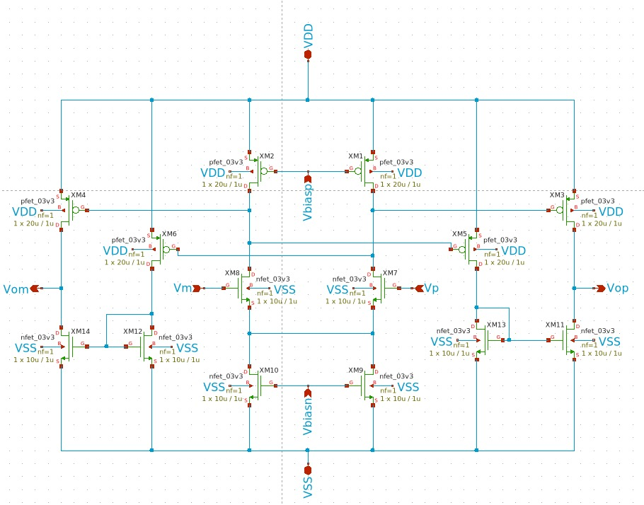
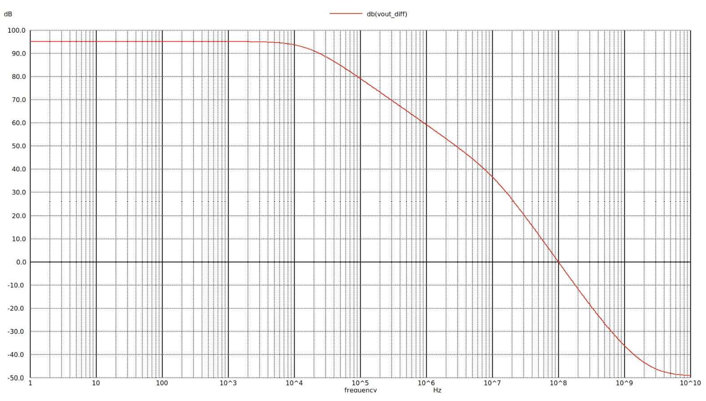
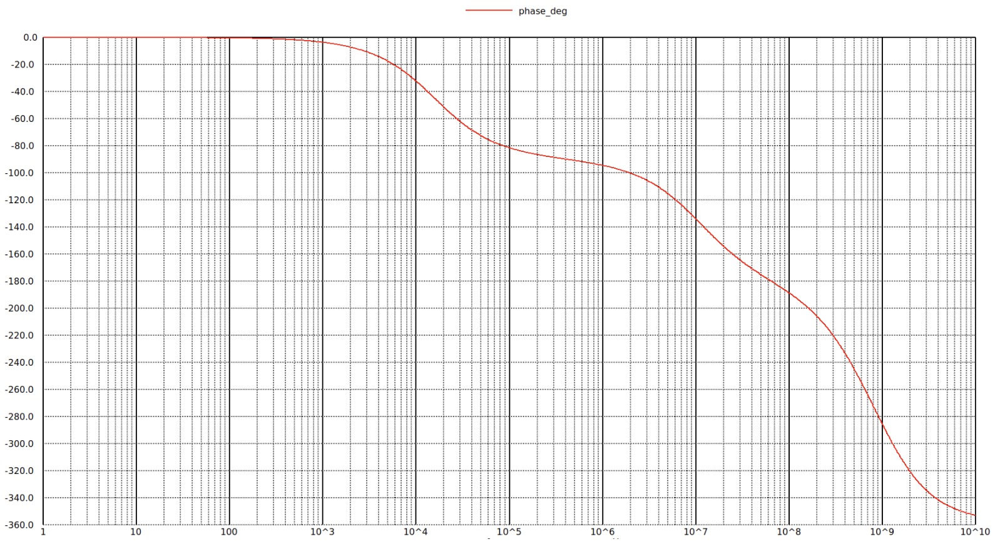
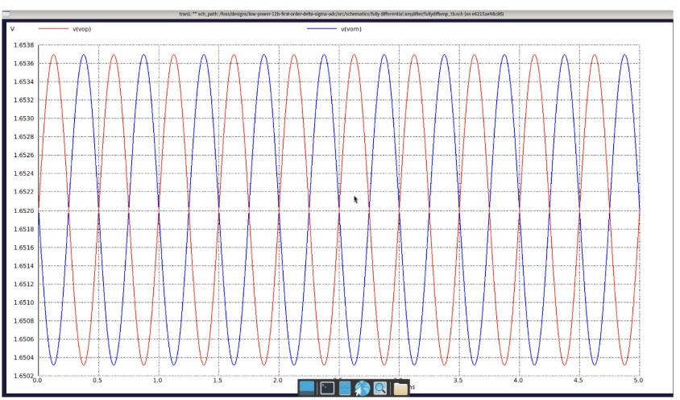
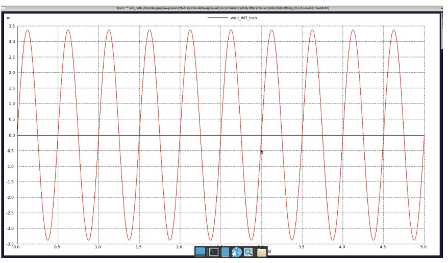
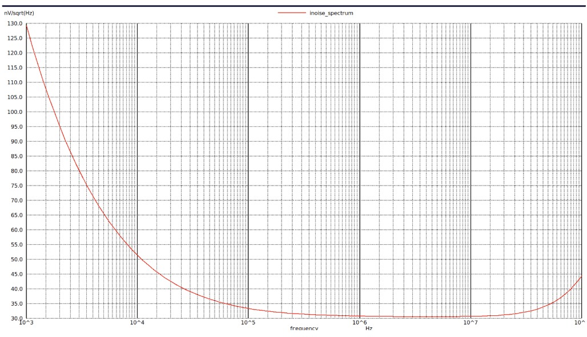
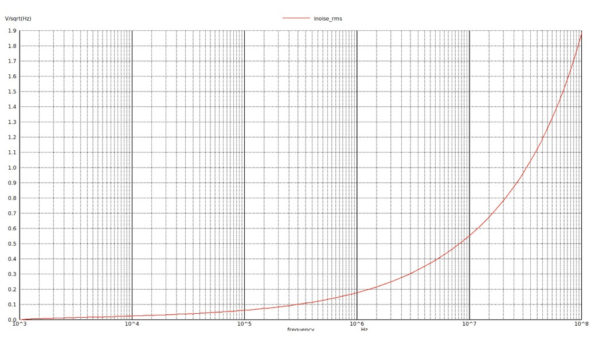

# Fully Differential Amplifier Progress Log

The fully differential amplifier is implemented as the main analog gain block used in the switched-capacitor integrator of the first-order sigma-delta ADC. Its function is to amplify the differential input signal while rejecting common-mode noise and maintaining a stable output common-mode level. In the sigma-delta modulator, this amplifier is critical because the integrator accuracy, settling behavior, noise performance, and linearity strongly depend on the OTA performance.

The amplifier is designed using a fully differential topology to improve noise immunity, common-mode rejection, and signal swing. Since the ADC uses a switched-capacitor integrator, the amplifier must provide sufficient DC gain, unity-gain frequency, phase margin, and slew rate so that the output can settle within the available clock phase. The sizing process is initially performed using the gm/ID methodology and then verified through ngspice simulations in Xschem.

## Target Specification

| **Parameter** | **Value / Target** | **Unit** |
|--------------|--------------------|----------|
| Supply Voltage | 3.3 | V |
| Input Type | Fully Differential | - |
| Output Type | Fully Differential | - |
| Input Common-Mode | 1.65 | V |
| Output Common-Mode | 1.65 | V |
| Target Input Bandwidth | >100 | kHz |
| OSR | 256 | - |
| Target Sampling Frequency | 12.288 | MHz |
| Target SNDR | >65 | dB |
| Target ENOB | >10 | bits |
| DC Gain | >60 | dB |
| Unity-Gain Frequency | >100 | MHz |
| Phase Margin | >55 | degree |
| Load Capacitance | 0.5 | pF |
| Power Consumption | < 3 | mW |

## Schematic Design

  

<h4 align="center" style="font-size:16px;">Figure 1. Fully Differential Amplifier Schematic</h4>

The amplifier is designed as a fully differential analog block with differential inputs Vp and Vm, and differential outputs Vop and Vom. The circuit is biased using Vbiasn and Vbiasp to set the operating currents of the NMOS and PMOS branches.

The topology is intended to provide high gain while maintaining sufficient speed for switched-capacitor operation. The amplifier output is used by the sigma-delta integrator, so the output must settle accurately before the next comparator decision and DAC feedback phase.

**Miller compensation** is applied to secure stability at the required bandwidth, using a compensation capacitor Cc = 0.1 pF in series with a nulling resistor Rz = 530 Ω on each output branch. The nulling resistor moves the right-half-plane zero introduced by the compensation capacitor, preserving phase margin near the unity-gain frequency.

## Design Considerations

| **Design Aspect** | **Consideration** |
|------------------|-------------------|
| DC Gain | Must be high enough to reduce integrator error |
| Unity-Gain Frequency | Must support fast switched-capacitor settling |
| Phase Margin | Required for stable closed-loop operation |
| Slew Rate | Must support large signal transitions within the clock phase |
| Output Common-Mode | Should remain close to 1.65 V |
| Input Common-Mode Range | Must support integrator and sampling network levels |
| Noise | Thermal noise and flicker noise must be considered |
| Power Consumption | Must fit within the ADC power budget |
| Device Matching | Important for differential symmetry and offset reduction |
| Saturation Margin | All analog MOSFETs should remain in saturation |

## gm/ID-Based Initial Sizing

The initial sizing is performed using the gm/ID methodology with GF180MCU 3.3 V transistor lookup tables. The target transconductance is derived from the settling requirement of the switched-capacitor integrator.

For the initial design, the input pair is targeted around moderate inversion to balance power efficiency and speed. Cascode, current source, and load devices are sized with longer channel lengths to improve output resistance and DC gain.

| **Transistor** | **Type** | **Function** | **L** | **Target gm/ID** | **Target gm** |
|---------------|----------|--------------|------:|-----------------:|--------------:|
| XM7 | NMOS | Input pair, Vp | 0.56 µm | 12 V-1 | 1.60 mS |
| XM8 | NMOS | Input pair, Vm | 0.56 µm | 12 V-1 | 1.60 mS |
| XM5 | PMOS | Folding / common-gate branch | 0.56 µm | 10 V-1 | 1.33 mS |
| XM6 | PMOS | Folding / common-gate branch | 0.56 µm | 10 V-1 | 1.33 mS |
| XM1 | PMOS | Current source / upper bias branch | 1.00 µm | 8 V-1 | 1.06 mS |
| XM2 | PMOS | Current source / upper bias branch | 1.00 µm | 8 V-1 | 1.06 mS |
| XM9 | NMOS | Current sink / lower bias branch | 1.00 µm | 8 V-1 | 1.06 mS |
| XM10 | NMOS | Current sink / lower bias branch | 1.00 µm | 8 V-1 | 1.06 mS |
| XM3 | PMOS | Output load, Vop side | 1.00 µm | 8 V-1 | 1.06 mS |
| XM4 | PMOS | Output load, Vom side | 1.00 µm | 8 V-1 | 1.06 mS |
| XM11 | NMOS | Output sink, Vop side | 1.00 µm | 8 V-1 | 1.06 mS |
| XM14 | NMOS | Output sink, Vom side | 1.00 µm | 8 V-1 | 1.06 mS |
| XM12 | NMOS | Bias / cascode / mirror branch | 1.00 µm | 8 V-1 | 1.06 mS |
| XM13 | NMOS | Bias / cascode / mirror branch | 1.00 µm | 8 V-1 | 1.06 mS |

> **Design iteration note:** the final input pair operates at gm/ID ≈ 20.79 V-1 (subthreshold region) rather than the initial target of 12 V-1. The higher gm/ID was adopted to improve noise efficiency and DC gain at constant current, and is reflected in the measured noise results below.

## Initial Transistor Sizing

The first-pass transistor widths are generated from GF180MCU gm/ID lookup tables. The width values are used as a starting point and must be verified using ngspice operating point simulation.

| **Transistor** | **Type** | **Wtotal** | **L** | **nf** | **W per Finger** |
|---------------|----------|----------------------:|------:|------:|-----------------:|
| XM7 | NMOS | 54.020 µm | 0.56 µm | 11 | 4.911 µm |
| XM8 | NMOS | 54.020 µm | 0.56 µm | 11 | 4.911 µm |
| XM5 | PMOS | 120.939 µm | 0.56 µm | 25 | 4.838 µm |
| XM6 | PMOS | 120.939 µm | 0.56 µm | 25 | 4.838 µm |
| XM1 | PMOS | 152.914 µm | 1.00 µm | 31 | 4.933 µm |
| XM2 | PMOS | 152.914 µm | 1.00 µm | 31 | 4.933 µm |
| XM9 | NMOS | 35.738 µm | 1.00 µm | 8 | 4.467 µm |
| XM10 | NMOS | 35.738 µm | 1.00 µm | 8 | 4.467 µm |
| XM3 | PMOS | 152.914 µm | 1.00 µm | 31 | 4.933 µm |
| XM4 | PMOS | 152.914 µm | 1.00 µm | 31 | 4.933 µm |
| XM11 | NMOS | 35.738 µm | 1.00 µm | 8 | 4.467 µm |
| XM14 | NMOS | 35.738 µm | 1.00 µm | 8 | 4.467 µm |
| XM12 | NMOS | 35.738 µm | 1.00 µm | 8 | 4.467 µm |
| XM13 | NMOS | 35.738 µm | 1.00 µm | 8 | 4.467 µm |

The sizing values above assume that the Xschem MOS symbol uses `w` as the width per finger and `nf` as the number of fingers. Therefore, the effective total width is approximately:

Wtotal = Wfinger × nf

## Simulation

The fully differential amplifier is simulated using Xschem and ngspice. The simulations are performed on the amplifier symbol in a separate testbench schematic. The testbench includes DC bias sources, differential input sources, output load capacitors, and common-mode control for initial verification.

Recommended simulations include:

| **Simulation** | **Purpose** | **Status** |
|---------------|-------------|:----------:|
| DC Operating Point | Verify bias currents, output common-mode, and device operating regions | ✓ |
| AC Differential Gain | Measure DC gain, unity-gain frequency, and phase behavior | ✓ |
| Transient Settling | Verify output settling within the available clock phase | ✓ |
| Slew Rate Test | Check large-signal output transition capability | — |
| Noise Simulation | Estimate input-referred and output noise | ✓ |
| Common-Mode Gain | Estimate CMRR | — |
| Power Measurement | Calculate amplifier power consumption | ✓ |
| Corner Simulation | Verify robustness across process, voltage, and temperature | — |

## DC Operating Point Result

The initial operating point simulation shows that the amplifier output common-mode is centered around mid-supply.

| **Parameter** | **Simulation Result** | **Unit** |
|--------------|----------------------:|----------|
| VDD | 3.300 | V |
| Vop | 1.650 | V |
| Vom | 1.650 | V |
| Output Common-Mode, VOCM | 1.650 | V |
| Differential Output, VOD | ≈0 | V |
| Supply Current | 476.108 | µA |
| Power Consumption | 1.572 | mW |

The output differential voltage is approximately zero under balanced DC input conditions, which is expected for a symmetrical fully differential amplifier. The current sign in ngspice depends on the voltage source current convention; therefore, the power is calculated as:

P = -VDD × I(VDD)

## Testbench Setup

  

<h4 align="center" style="font-size:16px;">Figure 2. Fully Differential Amplifier Testbench</h4>

The testbench uses a 3.3 V supply and a 1.65 V input common-mode voltage. The initial bias values are selected from the gm/ID lookup result.

| **Node / Source** | **Value** | **Unit** |
|------------------|----------:|----------|
| VDD | 3.3 | V |
| VSS | 0 | V |
| VCM | 1.65 | V |
| Vbiasn | 0.89 | V |
| Vbiasp | 2.30 | V |
| Differential AC Input | 1 | V |
| Load Capacitance per Output | 0.5 | pF |

## AC Response — Gain and Stability

  

<h4 align="center" style="font-size:16px;">Figure 3. Magnitude response of the fully differential amplifier</h4>

  

<h4 align="center" style="font-size:16px;">Figure 4. Phase response and phase margin</h4>

The frequency response shows a DC gain of **92.19 dB**, far exceeding the target of >60 dB, with a low-frequency dominant pole. After applying Miller compensation (Cc = 0.1 pF, Rz = 530 Ω), the unity-gain bandwidth is **101.47 MHz** with a clean −20 dB/decade roll-off extending past the 0 dB crossing. The phase curve yields a **phase margin of 68.90°** at the unity-gain frequency, comfortably meeting the stability criterion.

In the switched-capacitor integrator the amplifier operates in closed loop with a feedback factor β ≈ 0.5 (Cs/Cf = 1). The effective closed-loop bandwidth is therefore β × GBW ≈ 50.7 MHz, which is approximately **4× the sampling frequency** (12.288 MHz) — sufficient margin for the integrator output to settle within one clock phase.

| **Parameter** | **Measured** | **Target** | **Result** |
|--------------|-------------:|-----------:|:----------:|
| DC Gain | 92.19 dB | >60 dB | PASS |
| Unity-Gain Bandwidth | 101.47 MHz | >100 MHz | PASS |
| Phase Margin | 68.90° | >55° | PASS |
| Closed-loop BW (β ≈ 0.5) | ≈50.7 MHz | >4 × fs | PASS |

## Transient Response — Differential Operation

  

<h4 align="center" style="font-size:16px;">Figure 5. Transient differential outputs Vop and Vom</h4>

  

<h4 align="center" style="font-size:16px;">Figure 6. Differential output (Vop − Vom)</h4>

The transient simulation shows the differential outputs Vop and Vom to be perfectly out of phase — Vop rises as Vom falls — confirming correct differential operation. Both outputs oscillate symmetrically around a common-mode voltage of **1.651 V**, essentially exactly at the 1.65 V target, indicating that the ideal CMFB block successfully maintains the common-mode operating point.

The sine waveforms are smooth, with no visible distortion or clipping, indicating that the amplifier is operating in its linear region. The input amplitude was intentionally set very low (on the order of µV) to prevent the output from saturating given the 92 dB DC gain. The clean differential output (Vop − Vom) confirms the integrity of the amplification path.

| **Parameter** | **Measured** | **Target** | **Result** |
|--------------|-------------:|-----------:|:----------:|
| Output Common-Mode | 1.651 V | 1.65 V | PASS |
| Differential Phase Relation | 180° (out of phase) | 180° | PASS |
| Distortion / Clipping | None observed | None | PASS |

## Noise Analysis

  

<h4 align="center" style="font-size:16px;">Figure 7. Input-referred noise density (V/√Hz)</h4>

  

<h4 align="center" style="font-size:16px;">Figure 8. Integrated RMS noise versus upper integration limit</h4>

The input-referred noise density curve exhibits the expected profile: flicker (1/f) noise dominates at low frequencies with a corner frequency of approximately **10 kHz**, after which the curve flattens to a thermal noise floor of **~30–40 nV/√Hz**. Operating the input pair at a high gm/ID (20.79 V-1, subthreshold) keeps the input-pair thermal noise contribution low.

The integrated RMS noise rises with the upper integration limit. For a ΔΣ ADC the relevant figure is the noise integrated **within the signal band** (0–24 kHz), not up to the full 100 MHz bandwidth; this is estimated at **~15–30 µV rms**.

| **Parameter** | **Measured / Estimated** | **Unit** |
|--------------|-------------------------:|----------|
| Flicker noise corner | ≈10 | kHz |
| Thermal noise floor | 30–40 | nV/√Hz |
| Input pair gm/ID | 20.79 | V-1 |
| In-band integrated noise (0–24 kHz) | ~15–30 | µV rms |

With a differential full-scale input on the 3.3 V rail, an in-band noise of 30 µV rms corresponds to a thermal-noise-limited SNR well above 85 dB — far above the >65 dB SNDR target. The OTA noise is therefore **not the limiting factor** for the ADC resolution; quantization noise of the first-order modulator remains dominant.

## Verification Checklist

| **Checklist Item** | **Target / Requirement** | **Status** |
|-------------------|--------------------------|------------|
| Bias currents checked | Required | Verified in OP |
| Device operating regions verified | All MOS in saturation | To be verified |
| gm values checked | Match gm/ID target | Input pair updated to gm/ID 20.79 |
| Output common-mode verified | Around 1.65 V | Verified (OP + transient, 1.651 V) |
| DC gain measured | >60 dB | Verified (92.19 dB) |
| UGF measured | >100 MHz | Verified (101.47 MHz) |
| Phase margin analyzed | >55° | Verified (68.90°) |
| Transient settling checked | Within clock phase | Verified (closed-loop BW ≈ 4 × fs) |
| Noise considered | Required | Verified (~15–30 µV rms in band) |
| Power consumption checked | Within ADC budget | Verified (1.572 mW) |
| Slew rate measured | Within clock phase | Pending |
| CMRR measured | Required | Pending |
| PVT corners simulated | TT / FF / SS | Pending |
| CMFB strategy documented | Required for final FDA | In progress (ideal CMFB in current TB) |

## Performance of Designed Fully Differential Amplifier

| **Parameter** | **Value / Target** | **Unit** |
|--------------|--------------------|----------|
| Supply Voltage | 3.3 | V |
| Input Common-Mode | 1.65 | V |
| Output Common-Mode | 1.651 | V |
| DC Gain | 92.19 | dB |
| Unity-Gain Frequency | 101.47 | MHz |
| Phase Margin | 68.90 | degree |
| Closed-Loop Bandwidth (β ≈ 0.5) | ≈50.7 | MHz |
| Load Capacitance | 0.5 | pF |
| Compensation | Cc = 0.1 pF, Rz = 530 Ω | - |
| Power Consumption | 1.572 | mW |
| Input-Referred Noise (thermal floor) | 30–40 | nV/√Hz |
| Flicker Noise Corner | ≈10 | kHz |
| In-Band Integrated Noise (0–24 kHz) | ~15–30 | µV rms |
| Settling Time | To be simulated | s |
| Slew Rate | To be simulated | V/s |
| Corner Verification | Pending | - |

## Notes

The fully differential amplifier is one of the most important analog blocks in the sigma-delta ADC because it directly determines the accuracy and speed of the switched-capacitor integrator. The gm/ID sizing provided a reasonable starting point, and the design has since been iterated through operating point, AC, transient, and noise simulations. All primary specifications — DC gain, unity-gain bandwidth, phase margin, common-mode accuracy, noise, and power — now meet or exceed their targets.

For the current simulations, an ideal common-mode feedback helper is used to stabilize the output common-mode. The final fully differential amplifier must replace this with a proper CMFB circuit before layout; this remains the main outstanding design item, together with slew rate, CMRR, and PVT corner verification.

**Last Updated: 18th July 2026**